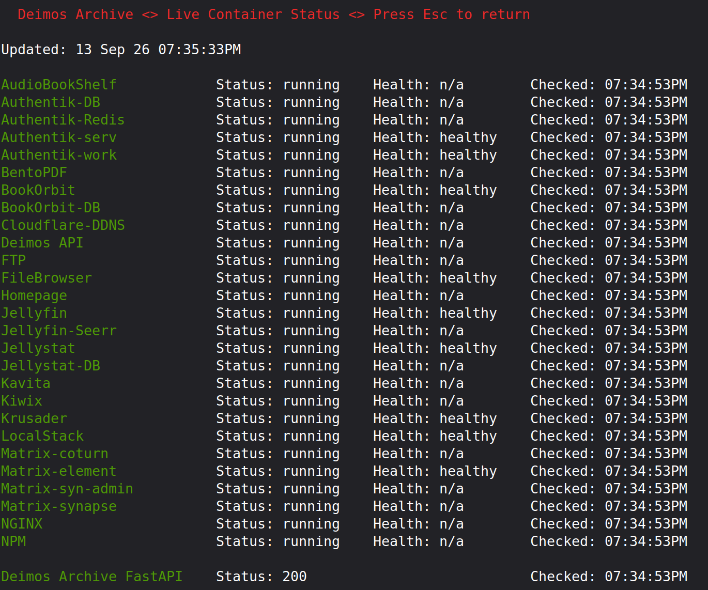
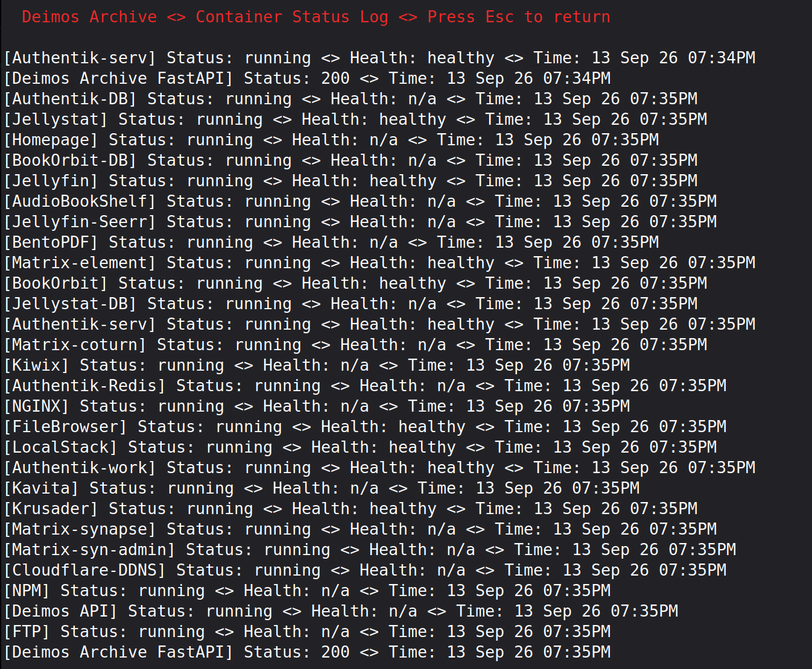

<div align="left">

[](https://github.com/docfrench/health_checker/actions/workflows/ci.yml)


</div>

# Health Checker

A small Go service that monitors the health of Docker containers and HTTP endpoints on a single host, logs current state, and provides a terminal UI for live status. Built for my Unraid server, but it runs anywhere with a Docker socket.



## Features

- Concurrent polling of containers and HTTP health endpoints (one goroutine per target)
- Persistent log of statuses
- Interactive TUI built with [Bubble Tea](https://github.com/charmbracelet/bubbletea): live status view and log tail
- Targets defined in a single `config.json`


## Quick start

1. Create a data directory and add your config (start from `config.json.example`):

```bash
   mkdir -p /path/to/appdata
   cp config.json.example /path/to/appdata/config.json
   # edit config.json with your server name and targets
```

2. Start the container:

```bash
   docker run -d --name health_checker \
     --restart unless-stopped \
     -v /var/run/docker.sock:/var/run/docker.sock \
     -v /path/to/appdata:/data \
     ghcr.io/docfrench/health_checker:latest
```

3. Open the TUI:

```bash
   docker exec -it health_checker ./health_checker --tui
```

The service writes its log and `status.json` to `/data`, so keep that directory writable and persistent.

> The container needs Docker socket access to read container state. Mounting it gives the container full Docker API access, so only run this on a host you control.


## Configuration

```json
{
  "server_name": "My Server",
  "containers": [
    { "label": "NPM", "name": "NginxProxyManager" }
  ],
  "http_endpoints": [
    { "label": "My Website", "url": "https://mywebsite.com/health" }
  ]
}
```

| Field | Meaning |
|-------|---------|
| `server_name` | Display name shown in the TUI |
| `containers[].label` | Name shown in the TUI |
| `containers[].name` | Docker container name to poll |
| `http_endpoints[].label` | Name shown in the TUI |
| `http_endpoints[].url` | URL to GET; the status code is recorded |


## How it works

On startup it loads `/data/config.json` and spawns a goroutine per target. Each one polls every 120 seconds (hardcoded), either asking the Docker daemon for container state or issuing an HTTP GET against the endpoint. Results are appended to the log and written to `/data/status.json`, which the TUI reads.

```json
{
  "updated_at": "2026-09-13T14:32:01-04:00",
  "containers": [
    {"label": "NPM", "status": "running", "health": "healthy", "checked_at": "2026-09-13T14:32:00-04:00"},
    {"label": "Jellyfin", "status": "running", "health": "n/a", "checked_at": "2026-09-13T14:32:00-04:00"}
  ],
  "http_checks": [
    {"label": "Deimos Archive FastAPI", "status_code": 200, "checked_at": "2026-09-13T14:31:58-04:00"}
  ]
}
```

## Views

| Logs | Live status |
|------|-------------|
|  |  |

## CI/CD

Every push to `main` runs a three-stage GitHub Actions pipeline:

1. **Lint:** `golangci-lint`
2. **Build and push:** Docker image to GHCR, tagged with the commit SHA and `latest`
3. **Deploy:** a self-hosted runner on the Unraid host pulls the new image and replaces the running container

Pull requests run the lint stage only.

## Development

```bash
go build -o health_checker .
golangci-lint run
```

Requires Go 1.26.

## License

MIT. See [LICENSE](LICENSE).
